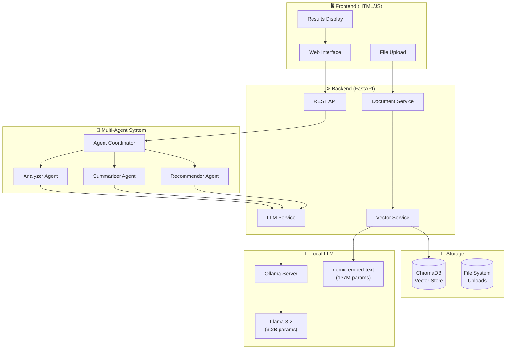
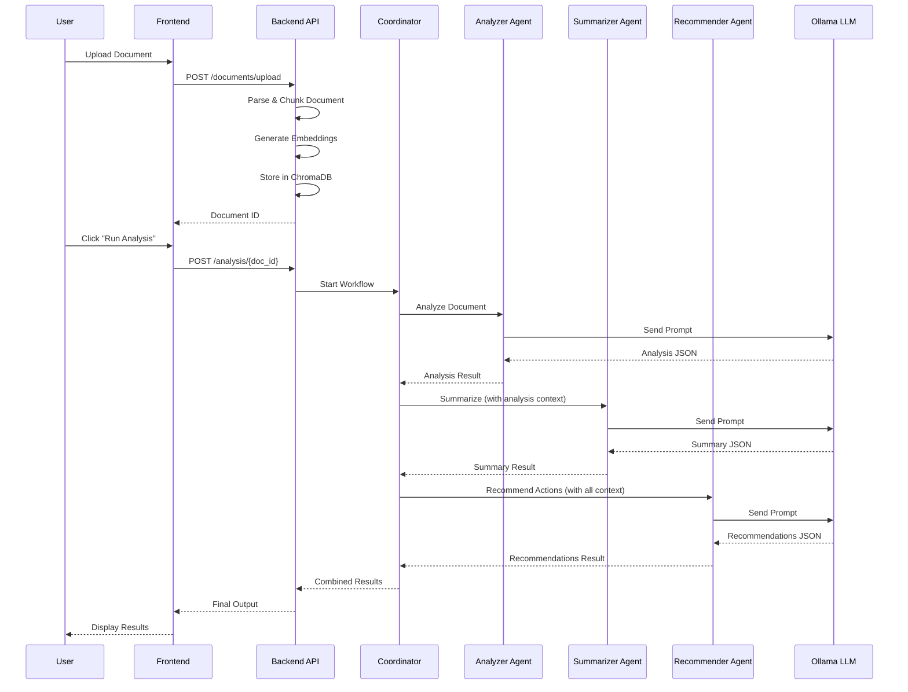

# 🧠 SynapseAI

**Multi-Mode Multi-Agent Decision Support System**

A sophisticated AI-powered document analysis platform that uses multiple specialized agents to extract insights, generate summaries, and provide actionable recommendations from any document type.

---

## 📊 System Architecture



---

## � Analysis Pipeline



---

## 🎯 Analysis Modes

| Mode | Icon | Description | Specialized Agents |
|------|------|-------------|-------------------|
| **Document** | 📄 | General analysis, entity extraction, summarization | AnalyzerAgent, SummarizerAgent |
| **Code Review** | 💻 | Bug detection, security audit, best practices | CodeAnalyzerAgent, CodeRecommenderAgent |
| **Research** | 📚 | Academic paper analysis, methodology review | ResearchAnalyzerAgent |
| **Legal** | ⚖️ | Contract analysis, risk identification, clause review | LegalAnalyzerAgent |

---

## 🏗️ Project Structure

```
synapse-ai/
├── 📁 backend/
│   ├── 📁 app/
│   │   ├── 📁 agents/           # Multi-Agent System
│   │   │   ├── base.py          # BaseAgent class
│   │   │   ├── analyzer.py      # Document/Code/Research/Legal analyzers
│   │   │   ├── summarizer.py    # Summarization agents
│   │   │   ├── recommender.py   # Action recommendation agents
│   │   │   └── coordinator.py   # Agent orchestration
│   │   ├── 📁 api/
│   │   │   └── 📁 routes/       # REST API endpoints
│   │   │       ├── documents.py # Upload/manage documents
│   │   │       ├── analysis.py  # Run analysis workflows
│   │   │       └── search.py    # Semantic search & RAG
│   │   ├── 📁 services/
│   │   │   ├── llm.py           # Ollama LLM wrapper
│   │   │   ├── vector.py        # ChromaDB vector store
│   │   │   └── document.py      # Document processing
│   │   ├── 📁 core/
│   │   │   ├── config.py        # App configuration
│   │   │   └── exceptions.py    # Custom exceptions
│   │   ├── 📁 utils/
│   │   │   ├── parser.py        # Multi-format file parser
│   │   │   └── chunker.py       # Semantic text chunking
│   │   └── main.py              # FastAPI application
│   ├── requirements.txt
│   └── .env
├── 📁 frontend/
│   └── index.html               # Single-page application
└── README.md
```

---

## 🔧 Technical Stack

### Backend
| Component | Technology | Purpose |
|-----------|------------|---------|
| Framework | FastAPI | Async REST API |
| LLM | Ollama + Llama 3.2 | Local AI inference |
| Embeddings | nomic-embed-text | Semantic search vectors |
| Vector DB | ChromaDB | Document storage & retrieval |
| Validation | Pydantic | Data validation |

### Frontend
| Component | Technology | Purpose |
|-----------|------------|---------|
| Framework | Vanilla HTML/JS | No build required |
| Styling | Custom CSS | Glassmorphism design |
| Animation | CSS Keyframes | Smooth UX |

---

## 📈 Performance Metrics

| Metric | Value |
|--------|-------|
| **Chunking Strategy** | Semantic-aware, 512 tokens/chunk |
| **Embedding Dimensions** | 768-dim vectors |
| **LLM Quantization** | Q4_K_M (~2GB) |
| **Average Latency** | 15-30s per analysis |
| **API Cost** | $0 (fully local) |
| **Supported Formats** | PDF, DOCX, TXT, MD, Python, JavaScript |

---

## 🚀 Quick Start

### Prerequisites
- Python 3.11+
- [Ollama](https://ollama.ai/) installed

### 1. Install Ollama Models
```bash
ollama pull llama3.2
ollama pull nomic-embed-text
```

### 2. Start Ollama Server
```bash
ollama serve
```

### 3. Setup Backend
```bash
cd backend
python -m venv venv
source venv/bin/activate
pip install -r requirements.txt
cp .env.example .env
uvicorn app.main:app --port 8002
```

### 4. Start Frontend
```bash
cd frontend
python3 -m http.server 3000
```

### 5. Open Browser
Navigate to `http://localhost:3000`

---

## 🤖 Agent Details

### Analyzer Agent
- **Purpose**: Extract structured information from documents
- **Output**: Document type, main topics, entities, sentiment, key points
- **Temperature**: 0.3 (consistent analysis)

### Summarizer Agent
- **Purpose**: Generate multi-level summaries
- **Output**: Executive summary, detailed summary, key takeaways, critical numbers
- **Temperature**: 0.5 (balanced creativity)

### Recommender Agent
- **Purpose**: Provide actionable insights
- **Output**: Action items with priority, decisions required, risks, quick wins
- **Temperature**: 0.4 (focused recommendations)

---

## 📡 API Endpoints

| Method | Endpoint | Description |
|--------|----------|-------------|
| `GET` | `/health` | System health check |
| `POST` | `/api/documents/upload` | Upload document |
| `GET` | `/api/documents/{id}` | Get document details |
| `POST` | `/api/analysis/{id}` | Run multi-agent analysis |
| `POST` | `/api/search/semantic` | Semantic document search |
| `POST` | `/api/search/ask` | RAG-based Q&A |

---

## 🎨 UI Preview

The interface features a modern glassmorphism design with:
- 🌓 Dark mode by default
- ✨ Animated gradients
- 📊 Structured result cards
- 🎯 Priority-based action highlighting

---

## 📄 License

MIT License - Free for personal and commercial use.

---

## 🛣️ Roadmap

- [ ] **v1.1**: Enhanced code review with line-level suggestions
- [ ] **v1.2**: Multi-document comparative analysis
- [ ] **v1.3**: Export to PDF/Markdown
- [ ] **v2.0**: Real-time collaborative analysis
- [ ] **v2.1**: Custom agent creation UI
