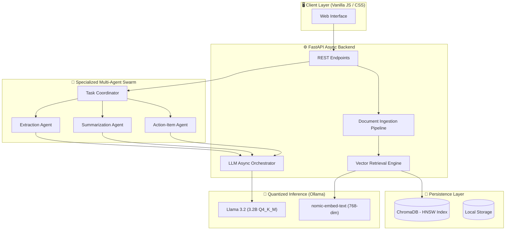

# 🧠 SynapseAI

**Production-Ready, Local-First Multi-Agent RAG System**

SynapseAI is not just another wrapper around an OpenAI endpoint. It is a highly optimized, local-first Decision Support System built from the ground up to solve real-world NLP engineering challenges: **context loss, LLM hallucinations, and high inference latency**. 

By orchestrating specialized agents (Analyzer, Summarizer, Recommender) over a robust Retrieval-Augmented Generation (RAG) pipeline, SynapseAI transforms raw documents (PDF, DOCX, Code) into structured, actionable, and most importantly, **verifiable** JSON outputs.

---

## 🛠️ Engineering Focus: Why Build This?

As an AI/NLP Engineer, the primary goal of this architecture was to address the core limitations of standard LLM deployments:

1. **Anti-Hallucination via Grounding:** LLMs tend to confidently invent facts when unsure. SynapseAI enforces strict grounding by injecting `chunk_index` metadata into prompts, forcing the LLM to cite its sources (e.g., `[Chunk 3]`). 
2. **Context-Aware Semantic Chunking:** Standard character splitters destroy sentence boundaries and code logic, confusing the embedding model. The custom `SmartTextChunker` preserves semantic integrity, keeps sentences intact, and applies specialized rules for code blocks versus prose.
3. **Hybrid Search via Entity Enrichment:** Before vectorizing text into ChromaDB, the pipeline extracts entities (dates, monetary values, organizations). This allows for hybrid retrieval (Semantic Cosine Similarity + Metadata Filtering), vastly improving retrieval recall compared to basic vector search.
4. **Local Inference & Privacy:** By utilizing 4-bit quantized models (`Llama 3.2 Q4_K_M`) via Ollama, the system runs entirely on local, consumer-grade hardware without sending sensitive corporate documents to third-party APIs. Cost = $0. Privacy = 100%.

---

## 📊 System Architecture


```mermaid
flowchart TB
    subgraph Client["🖥️ Client Layer (Vanilla JS / CSS)"]
        UI[Web Interface]
    end
    
    subgraph CoreBackend["⚙️ FastAPI Async Backend"]
        API[REST Endpoints]
        DocPipeline[Document Ingestion Pipeline]
        VectorEngine[Vector Retrieval Engine]
        LLMOrchestrator[LLM Async Orchestrator]
    end
    
    subgraph AgenticSystem["🤖 Specialized Multi-Agent Swarm"]
        Coordinator[Task Coordinator]
        Analyzer[Extraction Agent]
        Summarizer[Summarization Agent]
        Recommender[Action-Item Agent]
    end
    
    subgraph DataStore["💾 Persistence Layer"]
        ChromaDB[(ChromaDB - HNSW Index)]
        FileSystem[(Local Storage)]
    end
    
    subgraph InferenceEngine["🧠 Quantized Inference (Ollama)"]
        Llama["Llama 3.2 (3.2B Q4_K_M)"]
        Embed["nomic-embed-text (768-dim)"]
    end
    
    UI --> API
    API --> DocPipeline
    DocPipeline --> VectorEngine
    VectorEngine --> ChromaDB
    VectorEngine --> Embed
    API --> Coordinator
    Coordinator --> Analyzer
    Coordinator --> Summarizer
    Coordinator --> Recommender
    Analyzer --> LLMOrchestrator
    Summarizer --> LLMOrchestrator
    Recommender --> LLMOrchestrator
    LLMOrchestrator --> Llama
```

---

## 🧬 Core NLP Pipelines

### 1. Ingestion & Embedding Pipeline
When a document is uploaded, it isn't just dumped into a database. It goes through a robust ETL process:
- **Parsing:** Extraction of raw text and metadata using format-specific parsers (PyMuPDF for PDFs, python-docx for Word).
- **Semantic Chunking:** Splitting text via sentence terminators and overlapping sliding windows (1500 chars, 300 overlap) to prevent loss of context across chunk boundaries.
- **Entity Extraction:** Named Entity Recognition (NER) runs on chunks to pull keywords for enriched metadata.
- **Vectorization:** Text is mapped to a 768-dimensional space using `nomic-embed-text` and stored in ChromaDB using HNSW indexing for rapid approximate nearest neighbor (ANN) search.

### 2. Multi-Agent Analysis Pipeline
Instead of a single, massive prompt that degrades LLM attention, the reasoning task is divided:
- **Coordinator:** Analyzes user intent and routes context to the correct specialized agents.
- **Analyzer (Temp 0.3):** Highly deterministic. Extracts entities, sentiment, and main topics into strict JSON schemas.
- **Summarizer (Temp 0.5):** Balanced. Generates hierarchical summaries based on the Analyzer's context.
- **Recommender (Temp 0.4):** Generates actionable items, risk assessments, and next steps.

All agents are executed asynchronously (`asyncio.gather`) using `httpx.AsyncClient` to prevent API blocking. Pydantic enforces schema validation and auto-repairs malformed JSON responses from the LLM, ensuring the frontend never crashes on bad generation.

---

## 🚀 Technical Stack

| Domain | Technology | Engineering Rationale |
|-----------|------------|------------------------|
| **API Framework** | `FastAPI` | Asynchronous I/O handling is critical when waiting for long-running LLM generations. |
| **Inference Server** | `Ollama` | Seamless model management and memory-efficient quantized model execution. |
| **Vector Database** | `ChromaDB` | Persistent, fast local vector similarity search without heavy infrastructure overhead. |
| **Embeddings** | `nomic-embed-text` | Highly capable 768-dim model optimized for long context retrieval and semantic clustering. |
| **Validation** | `Pydantic` | LLM outputs are inherently non-deterministic; strict schema validation is non-negotiable for production. |

---

## ⚙️ Quick Start (Local Setup)

### Prerequisites
- Python 3.11+
- [Ollama](https://ollama.ai/) installed

### 1. Pull Quantized Models
```bash
ollama pull llama3.2
ollama pull nomic-embed-text
```

### 2. Start Inference Engine
```bash
ollama serve
```

### 3. Initialize Backend
```bash
cd backend
python -m venv venv
source venv/bin/activate
pip install -r requirements.txt
cp .env.example .env
uvicorn app.main:app --port 8002 --reload
```

### 4. Serve Frontend
```bash
cd frontend
python3 -m http.server 3000
```
Navigate to `http://localhost:3000`

---

## 📈 Performance & Metrics
- **VRAM Footprint:** ~2.5 GB total (1.5GB Llama + 0.5GB Nomic + API Overhead).
- **Chunk Size:** 1500 characters, ~350 tokens (optimized for Llama 3.2 context window).
- **Inference Latency:** 15-30 seconds for a full multi-agent pipeline pass on CPU/entry-level GPU.
- **API Cost:** $0.00 (Fully Local).

---

## 📄 License
MIT License.
